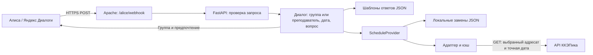

# Кэпик — навык Алисы

Навык сообщает расписание Краснодарского колледжа электронного приборостроения (ККЭП) на сегодня, завтра или выбранный день. Источник — [ККЭПик](https://kkepik.rub1kub.ru/api/docs/), программа, которая получает расписание колледжа.

На первом курсе Алиса называет предметы, на втором–четвёртом — фамилии преподавателей без инициалов. Кабинеты не озвучиваются. Группу и удобный формат достаточно выбрать один раз.

Отдельный запуск открывает разговор: «завтра» → «предметы» → «а на второй?». Навык помнит выбранный день и слушает уточнения; «спасибо» или «хватит» завершает разговор. Если назвать вопрос сразу при запуске, навык ответит и закроется. Выбор группы, уточнения и длинные ответы дочитываются до конца. «Оставайся в навыке» и «выходи после ответа» задают постоянное поведение независимо от способа запуска.

Публичная карточка **«Кэпик»** повторно отправлена на модерацию 18 сентября после размещения лендинга на главной. Страница проекта: [лендинг](https://kkepik.rub1kub.ru/). До одобрения и публикации для проверки используйте приватный навык. Инструкции — в [LAUNCH.md](docs/LAUNCH.md).

## Как звучит

Примеры ниже вымышлены:

| Запрос | Ответ |
| --- | --- |
| «Что завтра?» — первый курс | «2 пары. 2-я — Математика. 3-я — История.» |
| «Что завтра?» — старший курс | «2 пары. 2-я — Тестова. 3-я — Примеров.» |
| «Какая первая пара?» | «2-я пара — Тестова, в 10:25.» |
| «Сколько пар?» | «2 пары.» |
| «Ко скольки завтра?» | «К 10:25, 2-я пара.» |
| «До скольки завтра?» | «В 13:25, после 3-й пары.» |
| «Называй предметы» | «Буду называть предметы.» |
| «Расписание у Примеровой завтра» | «Примерова. 2 пары. 1-я — 103-Д9-3ИНС. 3-я — 104-Д9-3ИСП.» |

«Какие предметы завтра» и «кто ведёт пары» задают формат одного ответа. Команды «называй предметы», «называй преподавателей», «называй предметы и преподавателей» меняют сохранённый выбор. «Выбирай по курсу» возвращает автоматический режим.

«Какой предмет на второй паре завтра» отвечает только про второй номер пары. «Предметы» и «а какие предметы» — разовые уточнения. Пока навык открыт, они сохраняют выбранные день и группу или преподавателя. После автоматического выхода обратитесь к навыку заново и назовите день: «Алиса, спроси у Расписания Кэпика, какие предметы завтра». Для тестовой версии — «у Кэпика тест». Постоянная настройка ответа при этом не меняется.

Курс указан после последнего дефиса: `103-Д9-3ИНС` — третий, `141-Д9-1КСК` — первый. Если преподавателя нет в данных, навык называет предмет. Неизвестный курс тоже получает предметы.

«Расписание группы 104 завтра» — разовый запрос: сохранённая группа не меняется. «Моя группа 104» или «смени группу на 104» меняет её. Расписание преподавателя можно спросить без выбора своей группы. Если фамилии совпадают, навык просит фамилию с инициалами, но сам инициалы не произносит.

Можно коротко: «104 завтра», «у 104», «первая», «последняя», «сколько». В открытом разговоре «а у 104» сохраняет день, «а в пятницу» — выбранную группу или преподавателя, «а моя» возвращает свою группу. «Предметы», «фамилии» и «предметы и преподаватели» уточняют один ответ. «Без фамилий» тоже означает разовый ответ с предметами.

Вопросы «ко скольки» и «до скольки» сообщают время начала и конца занятий, если оно есть в данных. Несколько дней, номеров пар или адресатов в одном запросе требуют уточнения. Противоречащие друг другу даты не выбираются автоматически. Тестовая и публичная версии используют один backend; личные настройки хранятся отдельно для каждого навыка.

Сценарии студенческой проверки и её границы — в [CONVERSATION_QA.md](docs/CONVERSATION_QA.md).

## Архитектура



Backend работает отдельным сервисом. Он читает четыре публичных маршрута API ККЭПика. Код, БД и файловая структура бота и веб-приложения не меняются.

API уже возвращает расписание на конкретную дату, поэтому расчёт недель и PDF-парсинг остаются у источника. Адаптер переводит строки API в занятия; диалог работает с этими объектами. Другой источник подключается через `groups()`, `day(group_id, date)`, `teachers()` и `teacher_day(teacher_id, date)`. Запрос преподавателя использует его отдельный маршрут API; обход расписания всех групп не нужен.

Яндекс хранит группу и предпочтение пользователя. На сервере нет БД пользователей или истории запросов. Ответы собираются из шаблонов; внешняя языковая модель не нужна.

## Запуск

Нужен Python 3.12+.

```bash
python3.12 -m venv .venv
.venv/bin/python -m pip install -r requirements-dev.txt
.venv/bin/python -m scripts.validate_data --with-example
.venv/bin/pytest
.venv/bin/ruff check app scripts tests
.venv/bin/uvicorn app.main:create_app --factory --host 127.0.0.1 --port 18791 --no-access-log
```

Затем в другом терминале:

```bash
.venv/bin/python -m scripts.smoke
```

По умолчанию используется реальный API. Для автономного примера задайте `SCHEDULE_PROVIDER=file` перед запуском Uvicorn. Такие ответы начинаются с «Это пример расписания». Файл `.env` загружает Docker Compose; при локальном запуске переменные передаются через окружение.

## Что настраивается

| Файл | Содержимое |
| --- | --- |
| [data/responses.json](data/responses.json) | Все реплики, кнопки, режим по курсу, время занятий и длина части ответа |
| [data/college.json](data/college.json) | ККЭП, МСК, звонки, произношения групп и предметов, исключения, переопределения курса |
| [data/overrides.json](data/overrides.json) | Локальные замены на конкретную дату |
| [data/schedule.example.json](data/schedule.example.json) | Вымышленное расписание для автономного запуска |
| [.env.example](.env.example) | Параметры сервера, API и кэша |

Реплики и настройки колледжа читаются при старте. После их изменения достаточно перезапустить сервис. Замены подхватываются без перезапуска. Инструкции: [ответы](docs/RESPONSES.md), [данные](docs/DATA.md), [развёртывание](docs/DEPLOYMENT.md).

## Сценарии

- «Что завтра?» до выбора группы: навык спросит группу и вернётся к исходному вопросу.
- «Группа сто три» или «сто третья»: выберет `103-Д9-3ИНС`. Ошибочная `103-Д3-3ИНС` исключена только в конфигурации навыка; остальные группы доступны.
- «На пятницу»: ближайшая пятница, включая сегодня. «На следующую пятницу»: пятница следующей календарной недели.
- «На 25 сентября» или «на 25.09.2026»: точная дата. Без года выбирается ближайшая такая дата.
- «Какая первая пара» и «сколько пар» после расписания на завтра относятся к завтрашнему дню. Подгруппы не удваивают число пар.
- «Дальше»: продолжение длинного ответа. Если содержимое изменилось, выдача начнётся заново.
- «Смени группу», «список групп», «забудь группу», «моя группа», «выход»: управление диалогом. «Что ты умеешь» описывает возможности, «помощь» перечисляет команды.

Даты считаются по МСК. Выбор авторизованного пользователя хранится в `user_state_update`, гостя — в `application_state`. Вход в другой аккаунт не переносит гостевой выбор. В консоли нужно включить хранилище навыка. [Протокол Яндекса](https://yandex.ru/dev/dialogs/alice/doc/ru/session-persistence)

## Файлы проекта

```text
app/
  main.py           # Webhook, запуск и проверки доступности
  config.py         # Переменные окружения
  protocol.py       # Протокол Алисы
  models.py         # Формат данных
  providers.py      # API, кэш, файлы и замены
  language.py       # Группы, даты и команды
  teachers.py       # Фамилии, склонения и варианты произношения
  dialog.py         # Состояние диалога
  responses.py      # Проверка шаблонов и формат ответа
data/              # Расписание, настройки, примеры
deploy/            # Apache и карточка навыка
assets/            # Иконка PNG и исходник SVG
docs/              # Настройка и результаты проверок
scripts/
  validate_data.py
  publish_overrides.py
  smoke.py
tests/             # Диалоги, данные, провайдеры и ответы
Dockerfile
compose.yaml
pyproject.toml
requirements.txt
requirements.lock
requirements-dev.txt
```

## Работа под нагрузкой

Кэш расписания живёт 60 секунд, отсутствие публикации — 20 секунд. При сбое источника ещё 180 секунд можно получить сохранённую копию с предупреждением. После этого навык сообщает о недоступности. Каталог обновляется раз в 10 минут; при сбое его копия действует до суток.

Один процесс делает не более 4 обращений к API в секунду, объединяет одинаковые запросы и соблюдает `Retry-After`. Кэш ограничен 2048 записями. Для нескольких экземпляров нужен общий кэш и лимитер: у API есть общий лимит на IP. Результаты короткой проверки нагрузки и её границы описаны в [VERIFICATION.md](docs/VERIFICATION.md).

Обработка ограничена 2,8 секунды, запрос к источнику — 1,8 секунды. Длинный ответ делится на части по 700 символов; в настройках можно выбрать 300–1024. [Формат ответа Яндекса](https://yandex.ru/dev/dialogs/alice/doc/ru/response)

`ALICE_SKILL_ID` отсекает запросы другого навыка, но не подтверждает подлинность отправителя. Backend предоставляет только чтение расписания. Контейнер работает без root, с read-only FS и слушает loopback через Apache. Реплики, идентификаторы пользователей и тела ответов источника не записываются в логи.

## Публикация

[Webhook](https://kkepik.rub1kub.ru/alice/webhook) принимает POST. [Карточка навыка](https://dialogs.yandex.ru/developer/skills/e1db3ff8-41a7-4a69-bf69-1bb1de58d666/draft/settings/main) находится в Яндекс Диалогах. Реквизиты — в [skill-card.json](deploy/skill-card.json), проверенное состояние — в [VERIFICATION.md](docs/VERIFICATION.md). Доступ в каталоге зависит от модерации Яндекса.

Тексты отредактированы по [Sepia](https://github.com/Nanako0129/sepia/blob/main/skills/sepia/SKILL.md): убраны повторные пояснения, длинные вводные и подсказки, которые мешали услышать расписание.
